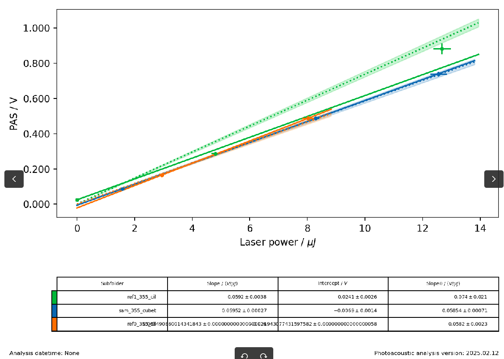

**Date:** 2026-03-09 03:09:06

starting excel writer implementation.
It was mostly easy, I only have to add the final analysis to the experiment and that's it.

Best regards,
Tomás

**Date:** 2026-03-09 00:36:53

Ok so now the figures are saved correctly and the summary pdf is built correctly, yet to achieve this I had to save figures as pickle, which makes it harder to build a real-time visualizer of the figures.

**Date:** 2026-03-08 22:11:04

figures are working now.

**Date:** 2026-03-08 17:04:13

All figures are built correctly now. 
The issue before was that watchdog's observer's queue wass filling up and dropping some of the events on it.
for that reason, some of the files created were ignored and never processed.

Now I have other issues: should move the experiment update functionality to the event handler and be sure that no analysis or plotting function is called if the created file is not a data file (including absorbance).
Right now, the copied .fl files are creating issues on the analysis bc some processing funcitons are being called at the wrong time.

**Date:** 2026-03-07 02:44:23

currently all figures but the linear are built correctly. 
linear fit looks like this:

there are like 4 linear plots. Colors are weird and it doesn't match the original analysis.